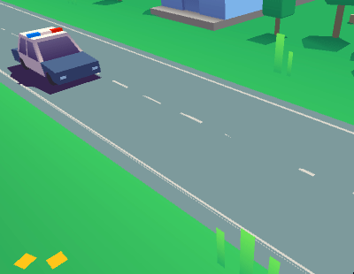

# Tweener

*A simple tool to be used for tweening in Unity.*

## Features

- **Extensible.** Use any types you want to tween. 
- **Simple.** Forget about dozens of classes.
- **Free.** Pull and use it for any purposes.

## Usage

1. **Allow the use of types**

```csharp
using AppInGap.Tweening;
```

2. **Instantiate a tweener**

```csharp
Tweener<Vector3> positionTweener = new Tweener<Vector3>(
	interpolator: Vector3.LerpUnclamped,
	animatePhysics: true,
	setter: value => transform.position = value
);
```

3. **Create a tween parameters' container**

```csharp
var tweenParams = new TweenParams<Vector3>()
{
	from = transform.position,
	to = transform.position + transform.forward * 3f
};
```

4. **Let the tweener do its work**

```csharp
positionTweener.Start(tweenParams, duration: 1f);
```

**Get the result**

